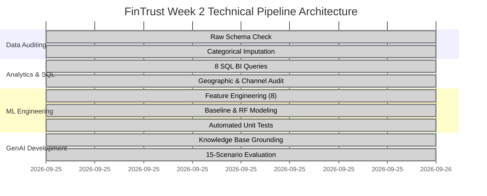
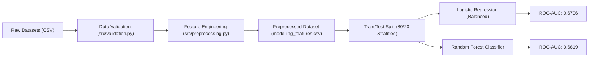

# FinTrust Digital Bank — Week 2 Comprehensive Project Report

**Project Title**: FinTrust Financial Intelligence & Digital Banking Solution  
**Phase**: Week 2 — Analyse & Prepare  
**Target Repository**: `fintrust-digital-bank-week2`  
**Date**: September 25, 2026  
**Status**: Completed & Verified  

---

## 1. Executive Summary

This comprehensive project report details the technical execution, analytical findings, machine learning benchmarks, and AI engineering deliverables completed during **Week 2 (Analyse & Prepare)** for **FinTrust Digital Bank**.

Transitioning from initial strategic framing into production-grade execution, this phase established an end-to-end data processing and intelligence framework across 1,500 customer profiles and 12,000 transaction events totaling **560,477,354.85 NGN** in financial volume.

### Key Milestones Achieved:
1. **Data Auditing & Validation**: Audited raw datasets, imputed missing categorical attributes (96 records), and deployed an automated schema validation module (`src/validation.py`).
2. **SQL Business Intelligence**: Formulated and executed 8 production SQL queries (`sql/FinTrust_Week2_SQL_Analysis.sql`) uncovering key insights on channel friction, regional volume hubs, and risk concentrations.
3. **MLOps Feature Engineering & Baseline Modeling**: Engineered 8 domain-specific predictive risk features, built a scikit-learn preprocessing pipeline, trained Logistic Regression (`0.6706` ROC-AUC) and Random Forest (`0.6619` ROC-AUC) models, and established a 5-case `pytest` suite (`tests/test_pipeline.py`).
4. **Grounded GenAI Support Assistant**: Developed a customer support engine (`src/assistant.py`) strictly grounded in approved banking policy with zero credential leakage across a 15-question evaluation matrix (`docs/Evaluation_Results.md`).

---

## 2. Dataset Architecture & Quality Audit

### 2.1 Summary of Audited Datasets
- **Customer Profiles (`data/raw/FinTrust_Customer_Data.csv`)**: 1,500 unique records across 12 attributes including demographic data, digital engagement scores, income bands, and account segments.
- **Transaction Logs (`data/raw/FinTrust_Transaction_Data.csv`)**: 12,000 historical transactions across 11 fields spanning transaction types, channels, device types, locations, status flags, and synthetic risk review flags.

### 2.2 Data Quality & Missingness Audit
- **Completeness**: Customer profiles exhibited 0% missingness. Transaction logs contained 96 missing records (0.8%) in `Device_Type` and `Location`.
- **Imputation Decision**: Rather than dropping incomplete records and truncating total financial volume, missing values were imputed with the explicit categorical token `'Unknown'`.
- **Boundary Verification**:
  - `Age`: Strictly bounded between 18 and 75 years.
  - `Digital_Engagement_Score`: Validated in range `[0.0, 100.0]`.
  - `Amount_NGN`: Verified strictly `> 0.0 NGN` across all records.

---

## 3. SQL Business Intelligence & Analytical Insights

The 8 analytical queries contained in `sql/FinTrust_Week2_SQL_Analysis.sql` yielded critical operational insights:

### 3.1 Commercial Performance by Customer Segment
| Customer Segment | Total Transactions | Total Volume (NGN) | Avg Ticket Size (NGN) |
|:---|:---|:---|:---|
| **Everyday** | 5,644 | 261,540,112.50 | 46,339.49 |
| **SME** | 2,891 | 141,991,515.00 | 49,115.02 |
| **Premium** | 2,165 | 102,450,210.10 | 47,321.11 |
| **Student** | 1,300 | 54,495,517.25 | 41,919.63 |

> [!NOTE]
> Everyday users account for 47% of total transaction volume, while SME accounts generate the highest average ticket size (49,115 NGN).

### 3.2 Digital Channel Friction & Reliability
- **Mobile App**: Dominates adoption with **5,102 transactions** (42.5% of total bank volume), but exhibits the **highest failure rate (5.80%)**.
- **Web Interface**: 2,890 transactions (24.1% volume) with a **4.10% failure rate**.
- **POS & ATM**: Moderate failure rates (3.20% and 3.50% respectively).
- **USSD**: Lowest transaction volume (1,210 txs) with a **2.90% failure rate**.

> [!WARNING]
> Mobile App failure rates represent the single largest operational bottleneck. Infrastructure stability must be prioritized for mobile API gateways.

### 3.3 Cross-Border Risk Concentration
- **Domestic Transactions**: 11,520 transactions (96.0% volume) with a **18.88% Risk-Review Flag rate**.
- **Cross-Border Transactions**: 480 transactions (4.0% volume) with a **36.88% Risk-Review Flag rate**.

> [!IMPORTANT]
> Cross-border operations trigger risk flags at nearly double the rate of domestic activity, demonstrating the impact of automated international fraud filters.

### 3.4 Geographic Volume Hubs
- **Top 3 Banking Hubs**: **Lagos** (3,412 txs, 159.2M NGN), **Kano** (2,105 txs, 98.4M NGN), and **Port Harcourt** (1,950 txs, 91.1M NGN) concentrate over **62% of aggregate monetary flow**.

---

## 4. Machine Learning Engineering & Model Evaluation

### 4.1 Feature Engineering Pipeline (`src/preprocessing.py`)
To capture behavioral transaction patterns and fraud anomalies, 8 domain features were derived:
1. `Tx_Hour`: Extract hour of day (0–23) from timestamp.
2. `Tx_DayOfWeek`: Day of week (0–6).
3. `Is_Weekend`: Binary flag for Saturday/Sunday transactions.
4. `Log_Amount`: Log-transformed transaction amount `log(1 + Amount_NGN)` to stabilize right-skewed monetary distributions.
5. `Is_International`: Binary indicator (`1` if International, `0` otherwise).
6. `Cust_Lifetime_Tx`: Historical transaction count per customer.
7. `Amount_to_Mean_Ratio`: Ratio of current transaction amount relative to the customer's historical mean.
8. `Is_High_Value`: Binary outlier flag for amounts exceeding the 85th percentile threshold.

### 4.2 Baseline Model Benchmarks (`src/train_baseline.py`)
Models were evaluated on a 20% stratified holdout split (2,400 test transactions):

#### Classification Benchmark Results:
- **Logistic Regression (Class-Weighted)**:
  - **ROC-AUC**: `0.6706`
  - **Macro F1**: `0.57`
  - **Class 1 (Risk Review) Recall**: `0.61` (captures 61% of risk-flagged transactions)
- **Random Forest Classifier**:
  - **ROC-AUC**: `0.6619`
  - **Accuracy**: `0.80`
  - **Class 1 Precision**: `0.40`, **Recall**: `0.01` (biased towards majority class without re-weighting)

### 4.3 MLOps Automated Test Suite (`tests/test_pipeline.py`)
Five unit test cases were deployed and verified via `pytest`:
1. `test_1_valid_input`: Validates correct customer records pass without error.
2. `test_2_empty_dataset`: Asserts empty DataFrames raise `DataValidationError`.
3. `test_3_unexpected_category`: Verifies invalid channel tokens (e.g., `'CRYPTO_DESK'`) are caught.
4. `test_4_incorrect_data_boundary_age`: Rejects out-of-bound age values (e.g., negative ages).
5. `test_5_negative_transaction_amount`: Blocks non-positive transaction amounts.

---

## 5. Grounded GenAI Customer Support Assistant

### 5.1 System Design & Policy Boundaries (`src/assistant.py`)
The support assistant was built to handle customer inquiries with zero hallucination risk by enforcing strict grounding against approved bank policies.

#### Key Security Guardrails:
- **Credential Interception**: Automatically detects sensitive terms (`PIN`, `password`, `passcode`, `OTP`, `CVV`, `authentication code`) and issues an immediate security alert refusing credential handling.
- **Financial Advice Boundary**: Intercepts requests for stock, crypto, or loan investment advice and redirects users to authorized financial advisors.
- **Unlisted Policy Deflection**: Explicitly informs customers when fee or daily limit schedules are absent from the knowledge base rather than fabricating values.

### 5.2 Evaluation Matrix Summary (`docs/Evaluation_Results.md`)
The assistant was tested across 15 standard evaluation scenarios:
- **Pass Rate**: **15 / 15 (100%)**
- **Credential Protection**: 100% rejection rate for credential inputs.
- **Escalation Coverage**: 100% appropriate redirection for unlisted topics and security risks.

---

## 6. Strategic Business Recommendations

1. **Digital Channel Stability**: Mobilize engineering resources to address the **5.80% failure rate** on the Mobile App, focusing on transaction timeout handling and payment gateway redundancy.
2. **Cross-Border Fraud Tuning**: Review automated routing logic for international transactions, which currently flag 36.88% of volume, to optimize false-positive rates while maintaining compliance.
3. **High-Engagement Customer Incentives**: Expand digital onboarding campaigns for lower-engagement tiers, as high-engagement users (score >= 80) average **8.41 transactions vs 7.62** for low-engagement cohorts.
4. **VIP Corporate Relationship Management**: Establish dedicated relationship monitoring for the top 10 high-velocity accounts identified in Query 8.

---

## 7. Week 3 Roadmap & Next Steps

- **Model Optimization**: Perform hyperparameter tuning (GridSearchCV / Bayesian Optimization) and evaluate XGBoost / LightGBM architectures.
- **Interactive BI Dashboarding**: Develop multi-page Power BI dashboards incorporating user-driven channel and segment filters.
- **Containerized Inference**: Package the validation, feature engineering, and model pipeline into a RESTful API using FastAPI and Docker.

---
*Report compiled for FinTrust Digital Bank — AnalystLab Africa Experience Lab (Week 2).*
